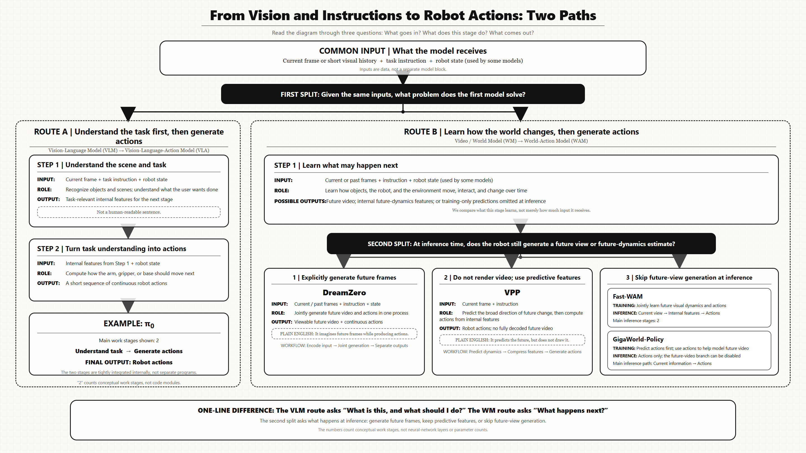

# From Vision and Instructions to Robot Actions: Two Emerging Paths

> First published on [theodoreoy.com](https://www.theodoreoy.com/personal-posts/from-vision-and-instructions-to-robot-actions/) on July 29, 2026. This is the bilingual portfolio edition.

## One-minute takeaway

Most discussions compare Vision-Language-Action models and World-Action Models as though they were two cleanly separated product categories. I find that framing too rigid. Both kinds of systems can receive images, language instructions, observation histories, and robot states. Both ultimately need to produce executable robot actions. The more useful question is what happens between those two endpoints.

After receiving an observation and an instruction, what is the model primarily trained to understand or predict before it generates an action?

For exposition, I use two broad routes. The first builds robot control on the semantic representations learned by a Vision-Language Model. The second introduces video prediction or world modeling so that the policy can learn how the physical world changes over time. The final output may be the same, but the representation passed to the action generator—and the learning objective that produces it—can be very different.

> **A note on the taxonomy.** These are analytical routes, not mutually exclusive model families. Contemporary systems increasingly hybridize semantic, temporal, and action objectives. The classification is useful only if it makes the training target and inference path easier to inspect.

*The diagram is organized around inputs, intermediate objectives, and inference-time computation. Select it to open the full-resolution version.*

## The common starting point

Both routes usually begin with some combination of visual observations, a natural-language instruction, and the robot's own state.

The visual input may be a single camera frame or a short history of frames. The instruction describes the task, such as “place the cup in the sink.” The robot state may include joint positions, gripper state, end-effector pose, or other proprioceptive information.

These inputs are data, not separate model modules. This sounds obvious, but it matters because diagrams often place “observation” and “language” next to VLM or WM boxes in ways that make them look like architectural components. They are simply the information supplied to the model.

The first meaningful classification point comes after these inputs enter the system: what problem is the model trained to solve first?

## Route A: understanding the task before generating the action

The first route begins with a pretrained Vision-Language Model and extends it into a Vision-Language-Action model.

A VLM is primarily designed to organize visual and linguistic information into a semantically useful representation. Given an image and an instruction, it can identify objects, interpret relationships, understand the request, and determine which parts of the scene are relevant to the task.

In a robotic system, however, the VLM does not necessarily generate a human-readable sentence and hand it to a separate controller. In most VLA systems, the action module reads internal hidden states or token embeddings directly.

These hidden representations encode what the model believes is present, what the instruction means, and which semantic goal should be pursued. They are machine-readable representations, not ordinary language. The action decoder or action expert then converts this context into an action chunk: a short sequence of continuous commands for the arm, gripper, mobile base, or other actuators.

> **Route:** Observation and instruction → semantic hidden representation → action generation

[π0](https://arxiv.org/abs/2410.24164) is a representative example. It places a flow-matching action expert on top of a pretrained VLM so that internet-scale semantic knowledge and continuous action generation interact inside one tightly coupled policy. It should not be read as two independent programs—one that writes a task description and another that controls the robot.

The advantage is clear. A pretrained VLM brings language understanding, object recognition, scene knowledge, instruction following, and web-scale semantic priors into robot learning. The robot does not need to learn every concept exclusively from expensive demonstrations.

A possible limitation is a semantic bottleneck. A representation optimized for recognizing objects and understanding instructions may compress some of the fine-grained temporal and physical details required for manipulation. It may understand that a cup must be picked up without representing, with equal fidelity, how contact will change the cup's pose or how the scene will evolve over the next several seconds.

This does not mean that VLM representations contain no spatial or physical information. It means that their dominant pretraining objective is usually semantic understanding rather than explicit prediction of physical evolution.

## Route B: learning how the world changes before generating the action

The second route begins with a video model or world model. Its central objective is not simply to recognize what is currently visible. It attempts to model what may happen next: how objects move, how the robot changes the environment, how contact affects the scene, and how visual states evolve over time.

> **Route:** Observation and instruction → future-world representation → action generation

“Future-world representation” does not always mean a complete RGB video that a person can watch. Depending on the architecture, it may be an explicitly decoded video, a sequence of video latents, internal predictive visual features, or a training-only target that is absent during deployment.

What these approaches share is not a single output format. They use future visual dynamics as a learning signal. Compared with highly compressed semantic representations, video-based representations can retain denser spatial and temporal structure: not only what an object is, but where it may move, how the robot could interact with it, and what physical consequences may follow.

This is the motivation behind World-Action Models. The action generator can benefit from a representation of possible physical evolution, rather than only a semantic account of the present scene.

The cost is equally important. Video modeling generally involves more tokens, memory, and computation than a compact action sequence. Explicit future-video generation can introduce substantial latency, especially when it requires iterative diffusion or denoising.

## The second split: what remains active during inference?

Once a model has learned from future visual dynamics, does it still need to generate—or explicitly compute—the future while controlling the robot?

This question separates designs that are often grouped together too loosely. Some models jointly generate future visual states and actions at inference time. Others retain predictive visual features without decoding a complete video. A third group uses video prediction during training but removes iterative future generation during deployment.

DreamZero, VPP, Fast-WAM, and GigaWorld-Policy illustrate the distinction particularly well.

## DreamZero: jointly generating the future world and the action

[DreamZero](https://arxiv.org/abs/2602.15922) is the most explicit World-Action Modeling example in this comparison. Built on a pretrained video diffusion backbone, it jointly models future video and robot actions. Given an observation, history, instruction, and relevant robot state, the model predicts how the visual world may evolve while generating the associated actions.

This should not be interpreted as a strict serial pipeline in which a standalone world model finishes a video and then hands it to an independent controller. The video and action streams are coupled inside the generative process. Future visual prediction provides dense supervision for physical dynamics, while action information connects visual evolution to executable behavior.

In plain language, DreamZero imagines future frames while producing actions that could bring about that future.

The formulation is intuitive: if the model can represent what successful task completion looks like over time, it may learn a richer connection between perception, dynamics, and control than a policy trained only to imitate action labels. The challenge is computational. Joint video-action generation requires systems optimization to run fast enough for closed-loop control.

## VPP: predictive visual features without drawing the full video

[Video Prediction Policy](https://arxiv.org/abs/2412.14803) occupies a middle position between explicit video generation and latent-to-action inference.

VPP uses a video diffusion model as an encoder of predictive visual representations. These internal features contain current scene information and a structured estimate of future evolution. A Video Former compresses the high-dimensional features, after which a diffusion policy generates robot actions.

The important technical point is that the main control path uses one forward pass through the video model to obtain a single-step predictive representation. It does not require the complete multi-step denoising process used to render a polished, human-viewable future video. Thirty-step videos are useful for visualization, but they are not the representation required by the deployed policy.

Describing VPP as “generate a complete video first, then infer the action from it” would therefore be inaccurate. A better description is that VPP constructs a future-oriented visual representation and conditions the action policy on that representation.

In plain language, VPP predicts the future, but it does not fully draw it.

## Fast-WAM: learning from future prediction without rolling it out

[Fast-WAM](https://arxiv.org/abs/2603.16666) asks whether the main value of a World-Action Model comes from explicit imagination at inference time or from the representations learned through video modeling during training.

Its controlled comparisons suggest that much of the value comes from the training objective. Fast-WAM retains video co-training: future video latents and action chunks both provide learning signals, shaping the video backbone into a physically informed world encoder.

At deployment, however, Fast-WAM removes the future-video branch and the iterative process of denoising future frames. It does not eliminate all future-aware computation. The clean observation tokens still pass once through the pretrained video DiT, now used as a single-pass world encoder, and the resulting latent world representation conditions the action expert.

> **Route:** Current observation → single-pass latent world representation → robot action

The concise description is: **training-time video co-modeling, test-time latent-to-action inference.** The model learns from future prediction without rolling out future video while controlling the robot.

This design aims to preserve the representational benefit of world modeling while removing one of its largest deployment costs: iterative test-time future generation.

## GigaWorld-Policy: making actions causally independent of future video

[GigaWorld-Policy](https://arxiv.org/abs/2603.17240) reaches action-only inference through a different architectural choice.

During training, it predicts future actions from the current observation. In parallel, it learns to generate future video conditioned on both the observation and the predicted actions. Future visual dynamics therefore supply dense physical supervision and encourage actions that are consistent with plausible scene evolution.

A causal attention mask prevents future-video tokens from influencing action tokens. The dependency runs in one direction: predicted actions can condition future-video generation, but action prediction itself does not depend on future-video tokens. The video branch can therefore be disabled at inference without changing the causal path used for actions.

> **Route:** Current observation → action-only decoding

GigaWorld-Policy still benefits from world modeling during training, but it treats action generation as the central task and future video as an auxiliary source of physical supervision. Its strategy can be summarized as: **train with visual dynamics; deploy with action-only decoding.**

Although Fast-WAM and GigaWorld-Policy both avoid future-video generation at inference time, their logic is not identical. Fast-WAM emphasizes the empirical value of video co-training and retains a single-pass world encoder. GigaWorld-Policy builds causal independence between the action and video branches into the architecture itself.

## What the comparison is really showing

The distinction between VLA and WAM should not be reduced to different inputs or final outputs. Both may consume images, language, observation histories, and robot states. Both eventually produce robot actions.

The deeper difference lies in what the model is trained to predict, what representation reaches the action generator, and which computations remain active at deployment.

The VLM-to-VLA route is organized primarily around semantic understanding: what is present, what the instruction means, and what the robot should do. The video/world-model route is organized around temporal and physical evolution: what may happen next, how the scene could change, and whether an action is consistent with that change.

VLM-based systems inherit strong semantic priors, language grounding, and internet-scale knowledge. Their representations can also be more compact, making high-frequency deployment easier. World-model-based systems introduce denser temporal and spatial supervision, potentially improving representations of motion, interaction, contact, and physical consequences. The trade-off is higher computation and memory cost, especially when future visual states are explicitly generated at inference time.

The frontier is therefore not a binary choice between VLA and WAM. The more useful question is how much world modeling is necessary, where it should enter the learning process, and whether it must remain active during deployment.

DreamZero keeps joint future-video and action generation inside inference. VPP extracts one-step predictive visual features without fully decoding a future video. Fast-WAM uses video modeling during training, then relies on a single-pass world encoder at inference. GigaWorld-Policy makes action generation causally independent of its optional future-video branch.

> **Spectrum:** Explicit future generation → predictive visual representation → training-time world modeling → action-only inference

The terminology remains unsettled. “World-Action Model” is an emerging label rather than a universally standardized architecture category, and the boundaries among VLA, video policy, world model, and WAM are increasingly blurred.

For that reason, I would not evaluate a new robot foundation model only by the label used in its paper. I would ask three concrete questions:

1. What is the model trained to predict?
2. What representation reaches the action generator?
3. Which computations remain active when the robot is running?

Those three questions explain the classification logic behind the diagram—and remain useful even as the names change.

## Primary sources

Technical descriptions were reviewed against the following paper versions available on July 29, 2026.

1. [π0: A Vision-Language-Action Flow Model for General Robot Control](https://arxiv.org/abs/2410.24164)
2. [Video Prediction Policy: A Generalist Robot Policy with Predictive Visual Representations](https://arxiv.org/abs/2412.14803)
3. [World Action Models are Zero-shot Policies](https://arxiv.org/abs/2602.15922)
4. [Fast-WAM: Do World Action Models Need Test-time Future Imagination?](https://arxiv.org/abs/2603.16666)
5. [GigaWorld-Policy: An Efficient Action-Centered World-Action Model](https://arxiv.org/abs/2603.17240)
