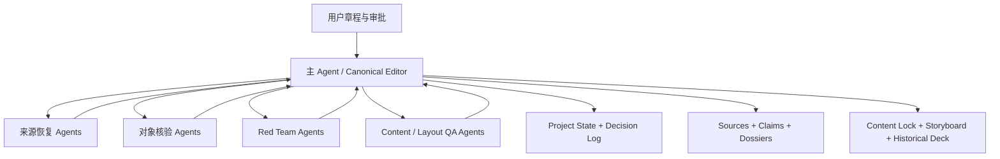

# Agent 编排方式

## 实际模式



主 Agent 通过 follow-up 继续复用活跃 Agent，而不是每次都创建新角色。会话中记录了：

- 90 次 follow-up；
- 54 次 Agent 消息；
- 146 次 Agent 等待；
- 2 次中断。

## 上下文策略

33 次创建请求中，32 次使用完整历史 fork，1 次只继承最近 4 轮。这保证了背景完整，但造成大量重复上下文和缓存输入，是本项目运行成本偏高的主要原因。

## 汇总原则

1. 子 Agent 返回发现、冲突、P0/P1/P2 和建议；
2. 主 Agent重新核验关键来源和当前文件；
3. 主 Agent统一修改 canonical 文件；
4. 独立 Agent再次对当前快照做只读复核；
5. 用户明确批准后才迁移状态。

## 下一版建议

将 Agent 固定为四个长期角色，并要求输出统一 JSON schema：

```json
{
  "agent_task": "technical_source_audit",
  "claim_ids": ["C-..."],
  "source_ids": ["S-..."],
  "support": [],
  "counterevidence": [],
  "unresolved": [],
  "recommended_status": "pass_with_limit"
}
```

这样可以减少完整上下文复制，并建立 Claim→Agent 的直接映射。

