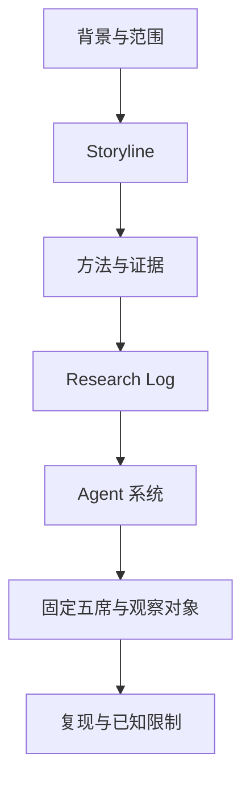

# Manifold 海外世界模型竞争格局

这是一个面向长期保存、复核和持续维护的研究仓库。

它回答的不是“谁的 Demo 最好看”，而是：在非中国世界模型创业公司和非中国大厂具体项目中，哪些对象已经形成可审计的动作条件世界模型路径，它们通过什么方式被外部获得，可能怎样影响 Manifold，哪些关键事实仍未成立。

## Executive Answer

海外世界模型已经从模型演示走向三种交付方式：

1. 公开计价接口；
2. 申请制或受控入口；
3. 可下载、自托管组件。

但截至 2026-07-14，公开证据尚不足以证明固定五席中的任何对象已经达到客户第一方确认的付费生产采用。

## 固定五席

- World Labs
- Odyssey
- Runway
- Decart
- NVIDIA Cosmos 3

这五席代表五种互补的产品和平台路径，不构成能力、公司或商业成熟度排名。

## 推荐阅读路径

五份对象研究已单独整理为 [`01 World Labs`](<dossiers/01 - World Labs.md>)、[`02 Odyssey`](<dossiers/02 - Odyssey.md>)、[`03 Runway`](<dossiers/03 - Runway.md>)、[`04 Decart`](<dossiers/04 - Decart.md>) 和 [`05 NVIDIA Cosmos 3`](<dossiers/05 - NVIDIA Cosmos 3.md>)。普通读者无需进入历史工作区寻找 dossier；方法、查询审计和完成 QA 也不会与五份对象页面混排。

## 证据规模

- 141 个来源登记；
- 141 张来源卡；
- 111 条原子主张；
- 5 份 dossier；
- 58 次定向查询；
- 63 条页面证据映射；
- 17 条固定五席监测信号；
- 5 条观察对象触发器。

## 关键边界

Manifold 仅作为 WorldScape / WorldScape Policy 的公开比较锚点。所有产品替代、平台替代和未来市场竞争判断均为相对于公开锚点的条件性分析，不证明现实客户、预算或采购位置已经重合。
