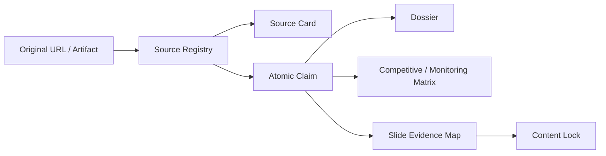

# 证据模型

## 数据结构

## Source Registry

`sources.csv` 记录：

- Source ID；
- 对象 ID；
- 来源类型和发布者；
- canonical URL；
- 发布/更新日期与访问日期；
- version/commit；
- 可信度、偏差和验证状态；
- 对应来源卡。

## Source Card

每张来源卡简要记录：

- 来源和访问日期；
- 支持什么；
- 不支持什么；
- 版本或组件边界；
- 必要时的冲突和反证。

## Evidence Ledger

Ledger 共 111 条 Claim、22 个字段。关键字段包括：

- `claim_id`；
- `object_id`；
- `component_or_version_id`；
- `claim_text`；
- `claim_type`；
- `decision_use`；
- `source_id`；
- `supporting_excerpt_or_paraphrase`；
- `conflict_or_limit`；
- `license_scope_if_applicable`；
- `last_checked_at`。

## 证据等级的解释

| 表述 | 含义 |
|---|---|
| 原始事实 | 官方文档、代码、论文、法律文本或登记记录直接支持 |
| 公司自报 | 公司说明其能力、伙伴或采用，但没有独立确认 |
| 伙伴第一方 | 伙伴公司确认测试、集成或内部部署 |
| 独立反证 | 独立体验、论文或复现揭示限制 |
| 条件性分析 | 研究者基于公开锚点进行的战略推断 |

## 机械完整性

当前快照中：

- 141/141 来源均有 canonical URL；
- 141/141 来源登记均能解析到来源卡；
- 111/111 Claim 均有 Claim ID、Source ID 和 URL；
- 63/63 页面证据映射 ID 唯一；
- 非空 Claim/Source/Monitor/Artifact 引用未解析数为 0。

