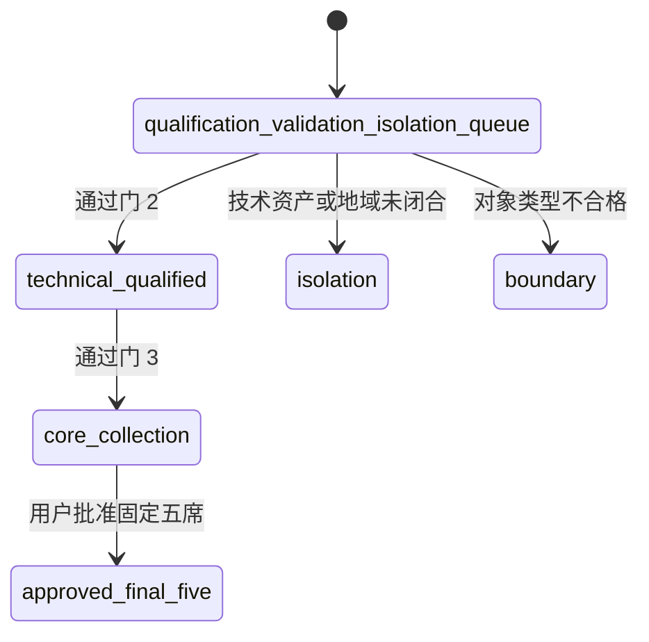

# 准入门与范围清洗

## 门 1：发现/验证队列

Self-positioned-only、证据待补或技术资格受挑战的对象可以进入，但必须明确标记。进入队列不代表技术合格。

## 门 2：核心技术资格

对象必须同时满足：

1. 表达随时间演化的状态；
2. 动作、控制或持续交互对后续状态产生可审计、时间一致的条件性影响；
3. 服务物理、具身、实时仿真或空间行动任务。

导航任务中，agent、robot、ego 或相机位姿、可达性、碰撞约束和持续记忆可以计入状态。仅施加外生相机轨迹、只改变像素或视角且没有持久状态或动作条件未来分支，不足以通过。

## 门 3：核心集合战略关系

至少存在以下一种相对于 Manifold 公开锚点的关系：

- potential product substitution；
- potential platform substitution；
- evidence-backed future market competition。

招聘、融资或人才重叠不能单独证明未来市场竞争，必须直接支持进入相同地域、客户任务或产品位置。

## 状态迁移

## 为什么 Meta 留在核心观察

V-JEPA 2-AC 有可下载 checkpoint、训练配置、代码和本地运行路径，形成受限的平台替代可能；但它只在窄机器人域通过门 2，许可和跨域复现未闭合，因此进入 core watch 而不是固定五席。

## 为什么 AMI 留在隔离层

地域后来闭合为非中国，但截至研究日仍没有可审计的自有模型、论文、演示、权重、接口或评测，因此没有通过技术门。

