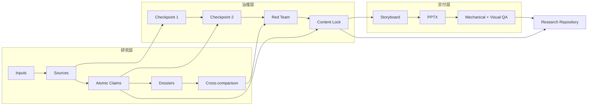

# 任务依赖关系图

```mermaid
flowchart LR
    subgraph Research[研究层]
      I[Inputs] --> S[Sources]
      S --> C[Atomic Claims]
      C --> D[Dossiers]
      D --> X[Cross-comparison]
    end

    subgraph Governance[治理层]
      G1[Checkpoint 1] --> G2[Checkpoint 2]
      G2 --> RT[Red Team]
      RT --> CL[Content Lock]
    end

    subgraph Delivery[交付层]
      CL --> SB[Storyboard]
      SB --> DECK[PPTX]
      DECK --> QA[Mechanical + Visual QA]
    end

    S --> G1
    C --> G2
    X --> RT
    C --> CL
    QA --> REPO[Research Repository]
    CL --> REPO
```

## 关键不可逆边界

- 检查点 1 前不得选择五席；
- 检查点 2 前不得创建五份 dossier；
- Content Lock 前不得制作页面和 PPT；
- 评分排名在任何阶段都不得解锁；
- 观察触发器不得自动改变固定五席。

