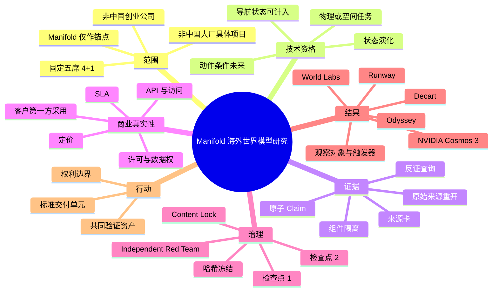

# 思维导图

```mermaid
mindmap
  root((Manifold 海外世界模型研究))
    范围
      非中国创业公司
      非中国大厂具体项目
      Manifold 仅作锚点
      固定五席 4+1
    技术资格
      状态演化
      动作条件未来
      物理或空间任务
      导航状态可计入
    证据
      原始来源重开
      来源卡
      原子 Claim
      反证查询
      组件隔离
    商业真实性
      API 与访问
      定价
      SLA
      许可与数据权
      客户第一方采用
    治理
      检查点 1
      检查点 2
      Independent Red Team
      Content Lock
      哈希冻结
    结果
      World Labs
      Odyssey
      Runway
      Decart
      NVIDIA Cosmos 3
      观察对象与触发器
    行动
      标准交付单元
      共同验证资产
      权利边界
```

