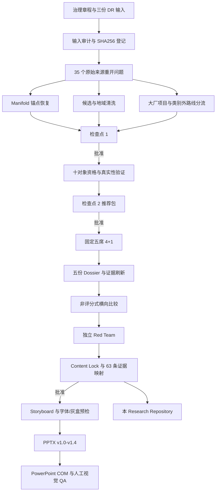

# 完整工作流

## 阶段退出条件

| 阶段 | 退出条件 |
|---|---|
| 输入审计 | 文件非空、名称和 SHA256 登记 |
| 来源恢复 | 决策主张有原始来源或明确 unresolved |
| 检查点 1 | 范围、三门、锚点、地域和队列获批准 |
| Phase 2 | 十对象完成技术、战略、访问和采用核验 |
| 检查点 2 | 固定五席明确批准 |
| Dossier | 支持性和反证性查询均关闭 |
| 横向比较 | 无评分排名，组件边界和证据上限一致 |
| Red Team | P0/P1/P2 全部关闭 |
| Content Lock | 10 页、63 映射、冻结哈希和审批闭环 |
| Storyboard | 字体、换行、灰盒和状态治理通过 |
| PPTX | 10 页实机渲染、机械 QA 和人工视觉 QA 通过 |
